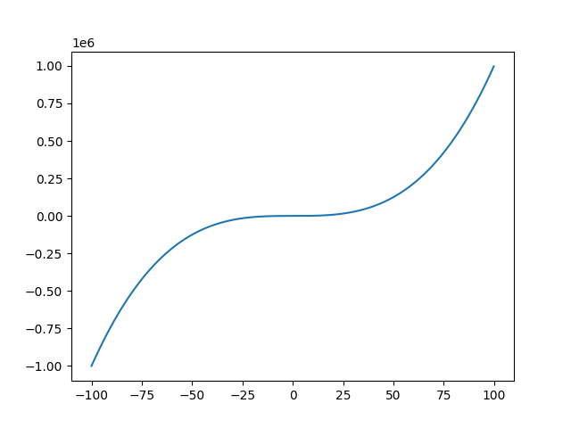

# MyFirstRepository
My First Repository

## Description
This is my first repository with a simple script to print a graph of the function x^3 written in Python, defining the start and end of the domain.

### Example

